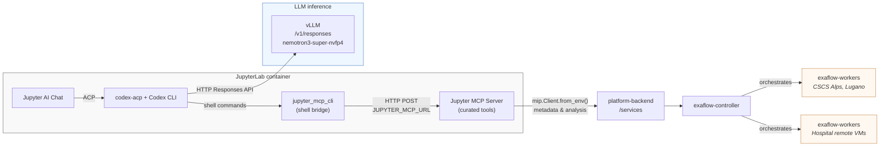

# MIP Platform Architecture

How Jupyter AI (Cohort Scout), the MIP platform stack, federated Exaflow workers, and vLLM inference fit together.

## Overview

## Federated execution stack

| Component | Role |
|-----------|------|
| **Jupyter MCP Server** | Curated tools inside JupyterLab; MIP calls go to platform-backend via `mip.Client.from_env()`. Notebook edit/run tools stay local. |
| **platform-backend** | Spring Boot API under `/services`; entry point for notebooks and portal — never Exaflow directly. |
| **exaflow-controller** | Quart HTTP API; validates analysis requests, selects execution strategy, orchestrates worker tasks. |
| **exaflow-workers (CSCS)** | gRPC workers running inside **CSCS Alps** (Lugano), the Swiss National Supercomputing Centre. |
| **exaflow-workers (hospitals)** | gRPC workers on **remote VMs at hospital sites**, holding local clinical data. |
| **vLLM** | OpenAI-compatible `/v1/responses` (`nemotron3-super-nvfp4`) for Cohort Scout via `CODEX_VLLM_BASE_URL`. |

Flow: `Jupyter MCP Server → platform-backend → exaflow-controller → exaflow-workers` (at CSCS or hospital remote VMs).

## Jupyter AI paths

| Path | When it runs | Notes |
|------|--------------|-------|
| Chat → Codex → vLLM | Every user message | Cohort Scout calls vLLM `/v1/responses` for inference. |
| Codex → shell bridge → MCP | Tool use from Codex | vLLM rejects native Responses `mcp` tools; Codex uses `jupyter_mcp_cli` instead. |
| MCP → platform-backend → Exaflow | MIP metadata and analysis | MCP tools call `/services`; backend forwards execution to the controller and workers. |
| MCP → local workspace | Notebook edits and runs | Outline, edit, and run-cell tools stay inside the JupyterLab container. |

## Why the shell bridge

vLLM rejects native Responses `mcp` and `web_search_preview` tool payloads. The runner sets `JUPYTER_MCP_URL` and instructs Codex to call curated tools through the CLI bridge. Native MCP forwarding is opt-in via `CODEX_ENABLE_NATIVE_JUPYTER_MCP=1`.

## vLLM

LLM inference uses a configured vLLM endpoint (`CODEX_VLLM_BASE_URL`, served id
`nemotron3-super-nvfp4` for `nvidia/NVIDIA-Nemotron-3-Super-120B-A12B-NVFP4`).
Hub passes `CODEX_REASONING_EFFORT` (default `low`). Catalog `base_instructions`
steer one topic-scoped `read-guide` cold start. This is separate from federated
analysis compute at CSCS and hospital workers.

See [jupyter-ai-codex.md](jupyter-ai-codex.md) for operator setup and verification.
